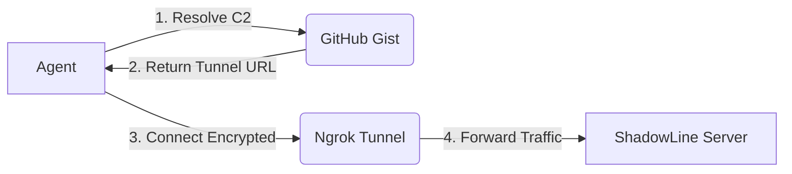

# ShadowlLine
ShadowLine: A lightweight post-exploitation tool and C2 infrastructure designed for stealth, persistence, and modern evasion techniques.
# 🕵️‍♂️ ShadowLine - Next-Gen C2 Framework


**ShadowLine** is a stealthy, modular, and cross-platform Command & Control (C2) framework written in **Go**. Designed for Red Team engagements and adversary emulation, it focuses on resilience and evasion.

Unlike traditional C2s, ShadowLine utilizes a **"Dead Drop" Architecture** via **GitHub Gists** and **Ngrok Tunnels**, making the infrastructure highly resistant to IP blocking and static analysis.

---

## ✨ Architecture & Workflow

### 🏗️ Infrastructure Logic
ShadowLine bypasses perimeter firewalls by piggybacking on legitimate services.


# 🚀 Key Features

## 🔥 Core Engine
- **Cross-Platform Agents**: Single codebase compiles for Windows, Linux, and MacOS.
- **Gist Resolver**: Dynamically fetches C2 address from GitHub, making the agent "IP-agnostic".
- **Ghost Mode**: Runs silently in the background (Windows) with no console window.

## 🧠 Advanced Capabilities
- **🔐 Encrypted Communication**: Traffic is tunneled through Ngrok (TLS), bypassing standard HTTP inspection.
- **🔄 Persistence**:
  - **Windows**: Auto-starts via Registry (`HKCU\Run`) and hides in `%APPDATA%`.
  - **Linux/Mac**: Auto-starts via Crontab (`@reboot`).
- **🛡️ Evasion**: Dynamic compilation ensures unique file hashes for every agent build.
- **💣 Self-Destruct**: Remotely uninstalls the agent and wipes traces (Registry/Files) with a single command.

## ⚔️ Offensive Modules
ShadowLine comes with built-in post-exploitation modules:

- **🐚 Remote Shell**: Execute system commands directly on the victim.
- **⬇️ Infiltration**: Download payloads or tools from the internet to the target.
- **⬆️ Exfiltration**: Steal sensitive files and upload them to the C2 server.
- **📸 Spyware**: Capture screenshots of the victim's desktop instantly.
- **🌊 Flood Attack**: Perform HTTP Flood (Stress Test) against specified targets.

## 📦 Installation
ShadowLine requires Go 1.21+ and an Ngrok account.

```bash
# 1. Clone the repository
git clone https://github.com/Mrex/ShadowLine.git
cd ShadowLine

# 2. Initialize the module
go mod tidy

# 3. Configure your infrastructure
cp config.json.example config.json
# Edit config.json with your GitHub Token and Gist ID

# 4. Run the Server
cd server
go run main.go
```
🛠️ Building Agents
Use the interactive builder to generate payloads for any OS.
```bash
cd builder
go run builder.go
```
## ⚠️ Legal Disclaimer

**ShadowLine** is a project developed strictly for educational purposes and authorized security research (Red Teaming).

- **No Liability**: The developer is not responsible for any misuse or damage caused by this program.
- **Authorization**: Usage of this tool for attacking targets without prior mutual consent is illegal.
- **Intent**: This project serves to demonstrate how modern C2 infrastructures operate to help Blue Teams improve detection mechanisms.

*By downloading or using this software, you agree to these terms.*
